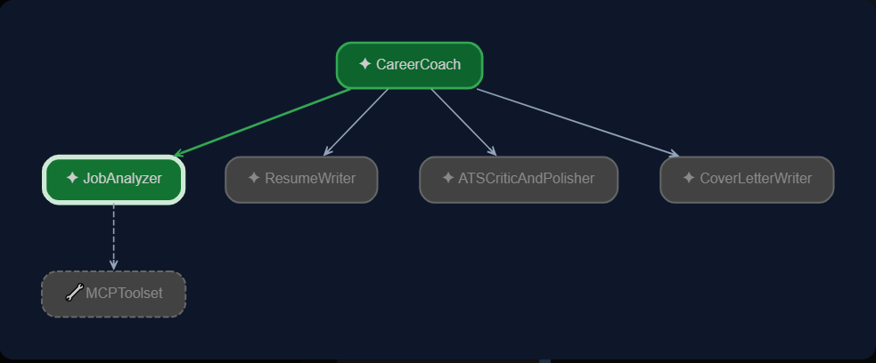
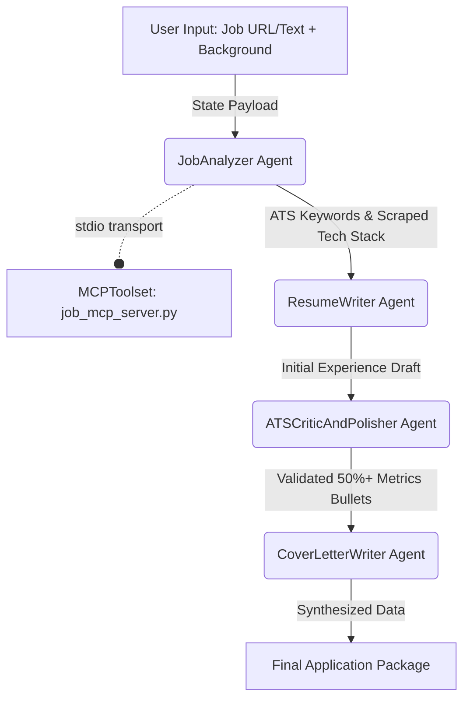

# 🎯 CareerCoach: Multi-Agent Resume & Cover Letter Engine


An automated, end-to-end career optimization engine built with the **Google Agent Development Kit (ADK)** and connected to the web via the **Model Context Protocol (MCP)**. 

Traditional multi-agent loops often suffer from "orchestrator ping-pong" and infinite validation loops—burning API tokens and causing cache misses. **CareerCoach** solves this by combining a deterministic **4-Stage Sequential Pipeline** with an isolated **stdio MCP Server**, allowing it to autonomously scrape live job posting URLs, inject quantifiable impact metrics, and draft executive cover letters in **exactly 4 API calls**.

---

## ⚡ Key Engineering Highlights

* **Live Web Scraping via MCP:** Connects to an isolated `stdio` microservice using `MCPToolset`. If you pass a live job posting URL or company name, the agent autonomously calls the MCP server to scrape clean HTML and fetch company tech insights before writing a single word.
* **80%+ Cost & Latency Reduction:** By locking execution into a linear 4-stage sequential timeline, the entire application package is generated in exactly 4 API calls (dropping execution costs from ~$0.20 to ~$0.03).
* **Zero Cache-Misses:** Eliminates system instruction flipping and dynamic prompt contamination (such as runtime timestamps), preserving 100% prompt prefix cache alignment across turns.
* **Inline ATS Validation:** Strict ATS constraints (e.g., *"50%+ of bullets must include quantifiable impact metrics"*) are embedded directly into a dedicated editor agent's instruction set, achieving first-attempt precision without paying for an external LLM validator loop.

---

## 🧠 System Architecture

The project utilizes a `SequentialAgent` orchestrator that moves conversation state deterministically through four specialized worker agents, with `JobAnalyzer` linked to an external toolset:





### 🤖 The Agent Pipeline
1. **`JobAnalyzer` (with MCP Toolset)**: Acts as an executive recruiter. It uses external tools to scrape live web URLs, extracts core engineering responsibilities, and isolates 5–8 critical ATS scanning keywords.
2. **`ResumeWriter`**: Maps the user's raw background to the target job requirements, producing a clean first draft of professional Markdown bullet points.
3. **`ATSCriticAndPolisher`**: An inline editorial agent that audits the draft. It rewrites bullet points to guarantee keyword injection and enforces that **at least half of all bullets contain concrete scaling numbers, percentages, or time-saved metrics**.
4. **`CoverLetterWriter`**: Synthesizes the parsed job requirements and the perfected resume bullets into an executive 3-paragraph cover letter, formatting the final output into a clean UI package.

---

## 📁 Repository Structure

```text
adk-agent-lab/
├── career_coach/
│   ├── agent.py               # Sequential pipeline orchestrator and agent definitions
│   └── job_mcp_server.py      # Stdio MCP server exposing web scraping & tech tools
├── architecture.png           # UI node graph screenshot
├── .env                       # API credentials (ignored by git)
├── .gitignore                 # Security exclusions
└── README.md                  # Project documentation
```

---

## 🚀 Getting Started

### 1. Prerequisites
Ensure you have Python 3.10+ and the fast dependency manager [uv](https://github.com/astral-sh/uv) installed on your system.

### 2. Installation
Clone the repository and set up your isolated virtual environment:

```bash
# Clone the repo
git clone [https://github.com/keerthan-m-shetty/adk-agent-lab.git](https://github.com/keerthan-m-shetty/adk-agent-lab.git)
cd adk-agent-lab

# Create and activate the virtual environment with uv
uv venv .venv
source .venv/bin/activate  # On Windows: .venv\Scripts\activate

# Install required dependencies (ADK, MCP, web scraping)
uv pip install google-adk python-dotenv mcp requests beautifulsoup4
```

### 3. Environment Configuration
Create a `.env` file in the root directory and add your Google Gemini API key:

```ini
GOOGLE_API_KEY="your_api_key_here"
MODEL="gemini-flash-latest"
```

---

## 🖥️ Running the Application

This repository integrates directly with the Google ADK local web server to provide real-time visual tracking of state transfers, MCP tool invocations, and execution logs.

1. Launch the ADK development UI from your terminal:
   ```bash
   adk web
   ```
2. Open your browser and navigate to `http://localhost:8000`.
3. Select **`career_coach`** from the top application dropdown.
4. Paste your target Job Description (or live web URL) and your background into the chat interface.

---

## 📋 Real-World Execution Example

### User Input Prompt
> **User:** *"Please help me prepare an application package for a Machine Learning Engineer role. Here is a link to the job posting: `https://join.com/companies/doopic/16438915-machine-learning-engineer-m-w-d?pid=...`*
> 
> *My background: ML Engineer specializing in LLM pipelines, RAG architectures, model fine-tuning with PEFT/LoRA, Next.js, and AWS."*

### Pipeline Execution & Generated Output
1. **MCP URL Scrape & Analysis (`## 📊 Job Analysis & ATS Keywords`)**: The `JobAnalyzer` automatically calls the MCP server to scrape the Doopic URL. It extracts core focus areas (*Automated Content Processing, E-Commerce Media Services, GenAI Integration*) and isolates high-priority ATS keywords: `PEFT/LoRA`, `RAG Pipelines`, `vLLM`, `Triton Inference Server`, `FastAPI`, and `Quantization (AWQ/GPTQ)`.
2. **Metric-Driven Bullet Points (`## 📄 Tailored Resume Bullets`)**: The `ATSCriticAndPolisher` upgrades the draft into action-led bullet points loaded with concrete scalability metrics:
   * *"Architected End-to-End RAG Pipelines: Engineered high-throughput RAG systems using LangChain, LlamaIndex, Qdrant, and AWS, **decreasing hallucination rates by 40%** and **enhancing context retrieval precision by 35%**..."*
   * *"Fine-Tuned Open-Source LLMs: Orchestrated PEFT/LoRA and QLoRA fine-tuning workflows on LLaMA 3 and Mistral models, achieving GPT-4 benchmark parity while **cutting inference costs by 60%**..."*
   * *"Deployed High-Scale Model Serving: Deployed containerized LLM endpoints via vLLM and Triton Inference Server on AWS SageMaker and EKS, attaining **sub-150ms Time-To-First-Token (TTFT)** across **15,000+ daily active requests**..."*
3. **Executive Narrative (`## ✉️ Customized Cover Letter`)**: The `CoverLetterWriter` synthesizes a 3-paragraph executive cover letter linking your full-stack capabilities (*Next.js / FastAPI*) and backend optimization skills (*AWQ/GPTQ quantization*) directly to Doopic's automated visual media processing roadmap.