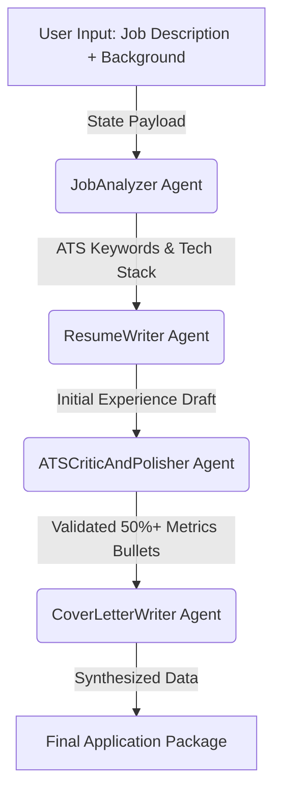

# 🎯 CareerCoach: Multi-Agent Resume & Cover Letter Engine


An automated, end-to-end career optimization engine built with the **Google Agent Development Kit (ADK)** and powered by **Gemini Flash**. 

Traditional multi-agent loops often suffer from "orchestrator ping-pong" and infinite validation loops—burning API tokens and causing cache misses. **CareerCoach** solves this by using a deterministic **Sequential Pipeline** that parses job descriptions, injects quantifiable metrics into resume bullets, and drafts customized cover letters in **exactly 4 API calls**.

---

## ⚡ Key Engineering Highlights

* **80%+ Cost & Latency Reduction:** Ditch unconstrained routing loops. By locking the execution into a linear 4-stage sequential timeline, the entire job package is generated in exactly 4 API calls (dropping execution costs from ~$0.20 to ~$0.03).
* **Zero Cache-Misses:** Eliminates system instruction flipping and dynamic prompt contamination (such as runtime timestamps), preserving 100% prompt prefix cache alignment across turns.
* **Inline ATS Validation:** Instead of paying for a separate LLM validator loop to reject drafts, strict ATS constraints (e.g., *"50%+ of bullets must include quantifiable impact metrics"*) are embedded directly into a dedicated editor agent's instruction set.

---

## 🧠 System Architecture

The project utilizes a `SequentialAgent` orchestrator that moves conversation state deterministically through four specialized worker agents:



### 🤖 The Agent Pipeline
1. **`JobAnalyzer`**: Acts as an executive recruiter to extract core engineering responsibilities, seniority levels, and 5–8 critical ATS scanning keywords.
2. **`ResumeWriter`**: Maps the user's raw background to the target job requirements, producing a clean first draft of professional Markdown bullet points.
3. **`ATSCriticAndPolisher`**: An inline editorial agent that audits the draft. It rewrites bullet points to guarantee keyword injection and enforces that **at least half of all bullets contain concrete scaling numbers, percentages, or time-saved metrics**.
4. **`CoverLetterWriter`**: Synthesizes the parsed job requirements and the perfected resume bullets into an executive 3-paragraph cover letter, formatting the final output into a clean UI package.

---

## 📁 Repository Structure

```text
adk-agent-lab/
├── career_coach/
│   └── agent.py       # Pipeline orchestrator and agent definitions
├── .env               # API credentials (ignored by git)
├── .gitignore         # Security exclusions
└── README.md          # Project documentation
```

---

## 🚀 Getting Started

### 1. Prerequisites
Ensure you have Python 3.10+ and the fast dependency manager [uv](https://github.com/astral-sh/uv) installed on your system.

### 2. Installation
Clone the repository and set up your isolated virtual environment:

```bash
# Clone the repo
git clone [https://github.com/keerthan-m-shetty/adk-agent-lab.git](https://github.com/keerthan-m-shetty/adk-agent-lab.git)
cd adk-agent-lab

# Create and activate the virtual environment with uv
uv venv .venv
source .venv/bin/activate  # On Windows: .venv\Scripts\activate

# Install required dependencies
uv pip install google-adk python-dotenv
```

### 3. Environment Configuration
Create a `.env` file in the root directory and add your Google Gemini API key:

```ini
GOOGLE_API_KEY="your_api_key_here"
MODEL="gemini-flash-latest"
```

---

## 🖥️ Running the Application

This repository integrates directly with the Google ADK local web server to provide real-time visual tracking of state transfers and tool execution.

1. Launch the ADK development UI from your terminal:
   ```bash
   adk web
   ```
2. Open your browser and navigate to `http://localhost:8000`.
3. Select **`career_coach`** from the top application dropdown.
4. Paste your target Job Description and your background into the chat interface to generate your application package.

---

## 📋 Example Output Format

When the pipeline completes its 4-step execution, it outputs a clean, markdown-ready application suite organized into three distinct sections:

* `## 📊 Job Analysis & ATS Keywords`: Target role breakdown, technology stack mapping, and critical scanning keywords.
* `## 📄 Tailored Resume Bullets (ATS Validated)`: Action-verb-led experience bullet points loaded with quantifiable metrics (e.g., *reduced latency by 32%, processed 100k+ daily records, boosted accuracy by 38%*).
* `## ✉️ Customized Cover Letter`: A persuasive, highly tailored 3-paragraph narrative linking your exact technical stack to the company's core initiatives.
